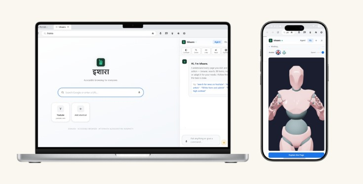
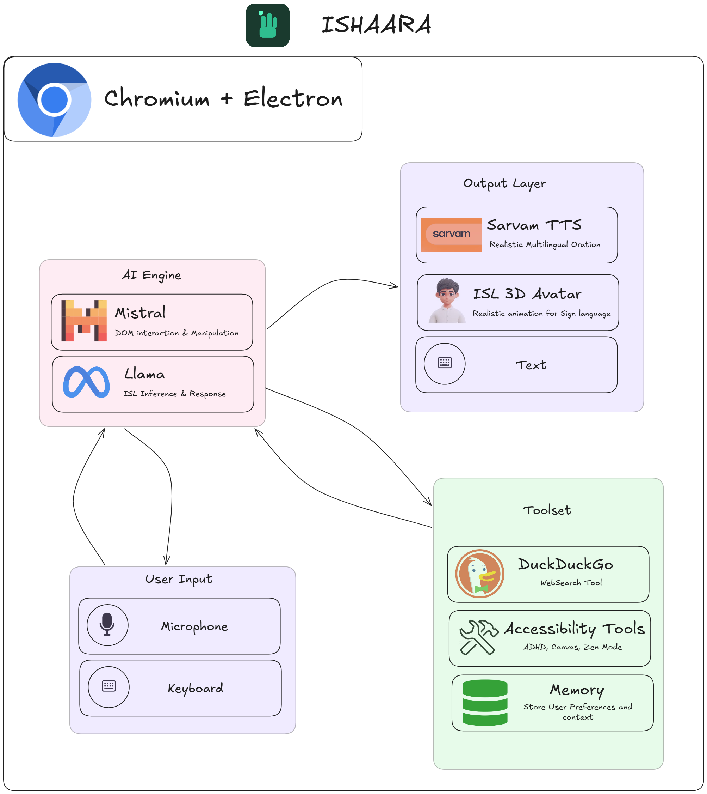

<p align="center">
  
</p>

<h1 align="center">Ishaara</h1>
<p align="center"><strong>A Human-Adaptive Edge-AI Browser</strong></p>
<p align="center">
  Dismantling digital barriers for users with disabilities and low digital literacy, in real time, on-device, at zero AI cost.
</p>

<p align="center">
  
  
  
  
</p>

---

## What is Ishaara?

Most browsers treat users as passengers. They render what websites give them and expect users to adapt. **Ishaara does the opposite.**

Ishaara is a high-performance, accessibility-focused web browser powered by a **Human-Adaptive Engine** that re-engineers websites in real-time. Instead of asking the user to learn the machine, Ishaara makes the machine learn the user, detecting disabilities, preferences, and literacy levels at startup and silently reshaping the entire web experience to match.

All AI runs **locally on your device**. No cloud. No cost. No privacy tradeoff.

<p align="center">
  
</p>

---

## Core Features

### Adaptive Entry and Environment Detection

Ishaara instantly detects specific user needs at launch and activates dedicated high-performance environments.

| Mode | What It Does |
|------|-------------|
| **ADHD Zen Mode** | Uses DOM injection to physically strip flashing ads, pop-ups, and cognitive clutter before they render |
| **Sign-Language Canvas** | Extracts on-screen content via DOM, converts it to Gloss, then renders Indian Sign Language using a 3D avatar |
| **High Contrast** | Forces black/white rendering for low-vision users |
| **Dyslexia Font** | Switches to dyslexia-friendly typography with wide letter spacing |
| **Colour Filters** | Protanopia, deuteranopia, tritanopia, and greyscale overlays |

### Inclusive Dialogue and Guided Navigation

| Feature | Description |
|---------|-------------|
| **Multilingual Agent** | An AI companion that simplifies complex web navigation into natural-language conversation, handling interaction on the user's behalf |
| **Regional Oration** | Sarvam TTS integration for realistic, high-fidelity audio guidance across Indian regional languages |
| **Frictionless Navigation** | "Digital Friend" logic that automates clicking and form-filling for users with motor impairments or tremors |
| **Voice Commands** | Speak to navigate, click, type, scroll, or search, hands-free |

### Privacy and Security

- **Edge-First Architecture** - camera and microphone inputs are processed entirely on-device
- **Local Encrypted Memory** - user context and preferences stored locally; zero data transmitted to external servers
- **Zero AI Cost** - runs quantized open-source Llama and Mistral models via TensorFlow.js

---

## Architecture

Ishaara is built on a dual-platform engine designed to deliver high-level intelligence without high-level hardware requirements.

<p align="center">
  
</p>

### File Structure

```
Ishaara/
├── main.js                  # Electron main process, window, IPC, AI bridge
├── preload.js               # Context bridge, exposes safe APIs to renderer
├── src/
│   └── mistral-service.js   # Local AI client (Mistral/Llama), prompt engineering
└── renderer/
    ├── index.html            # Browser shell, toolbar, AI panel, gesture canvas
    ├── styles.css            # Accessibility-first stylesheet
    ├── app.js                # DOM extraction, action executor, voice, TTS, chat UI
    └── home.html             # Custom adaptive home/new-tab page
```

### Platform Layers

```
+-------------------------------------------------------------+
|                    Desktop Core (Electron)                   |
|        Chromium + DOM Injection, Real-time re-engineering    |
+-------------------------------------------------------------+
|               Mobile Bridge (React Native + WebView)         |
|       Optimised for 1-2 GB RAM entry-level smartphones       |
+-------------------------------------------------------------+
|                     Edge-AI Engine                           |
|  Quantized Llama / Mistral, TensorFlow.js, 100% On-Device   |
+-------------------------------------------------------------+
```

### Data Flow

```
User speaks / types / gestures
  -> Gesture/Voice layer processes input locally
    -> DOM extracted from live page (executeJavaScript)
      -> Local AI (Mistral/Llama) reasons over DOM + command + history
        -> Returns: speech, actions[], simplification
          -> Actions executed on webview (click / type / navigate / a11y)
            -> Sarvam TTS reads response aloud in user's language
```

---

## Quick Start

### Prerequisites

- [Node.js](https://nodejs.org) v18 or later
- API keys for the services listed below

### Install

```bash
git clone https://github.com/your-org/ishaara.git
cd ishaara
npm install
```

### Configure

Create a `.env` file in the project root with the following keys:

```env
MISTRAL_API_KEY=your_mistral_api_key
MISTRAL_MODEL=mistral-large-latest
GROQ_API_KEY=your_groq_api_key
TAVILY_API_KEY=your_tavily_api_key
SARVAM_API_KEY=your_sarvam_api_key
GEMINI_API_KEY=your_gemini_api_key
ASSEMBLYAI_API_KEY=your_assemblyai_api_key
```

| Variable | Required | Description |
|----------|----------|-------------|
| `MISTRAL_API_KEY` | **Required** | Mistral API key for the on-device AI agent |
| `MISTRAL_MODEL` | **Required** | Model name, e.g. `mistral-large-latest` |
| `GROQ_API_KEY` | **Required** | Groq API key for fast inference |
| `TAVILY_API_KEY` | **Required** | Tavily API key for web search |
| `SARVAM_API_KEY` | **Required** | Sarvam TTS key for regional audio guidance |
| `GEMINI_API_KEY` | **Required** | Google Gemini API key |
| `ASSEMBLYAI_API_KEY` | **Required** | AssemblyAI key for speech-to-text |

You can also enter keys at runtime via the **Settings** panel.

### Run

```bash
npm start
```

Developer mode (DevTools open):

```bash
npm run start:dev
```

---

## Keyboard Shortcuts

| Shortcut | Action |
|----------|--------|
| `Ctrl+Shift+V` | Toggle voice command |
| `Ctrl+L` | Focus address bar |
| `F5` | Reload page |
| `Alt+Left` | Go back |
| `Alt+Right` | Go forward |
| `Esc` | Stop speaking / close panel |
| `Enter` in chat | Send command |
| `Shift+Enter` | New line in chat |

---

## Example Voice Commands

> "Go to the UIDAI website"
> "Fill in the Aadhaar form with my details"
> "Read me the main content"
> "Turn on ADHD mode"
> "Make the text bigger"
> "Scroll down slowly"
> "Click the submit button"
> "What does this page say?"


